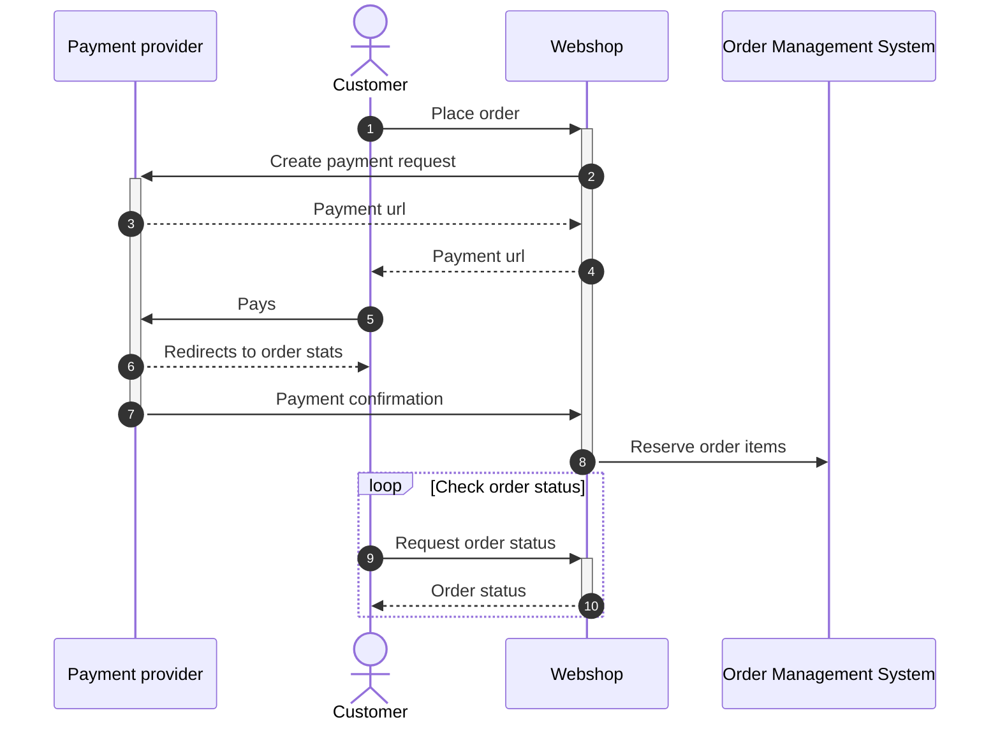

# Sequence diagram

> This is a Mermaid diagram. It is a simple way to create diagrams in markdown.
> For more information, see the [Mermaid documentation](https://mermaid.js.org/syntax/sequenceDiagram.html).
> [Visual Studio Code extension](https://marketplace.visualstudio.com/items?itemName=shd101wyy.markdown-preview-enhanced)

