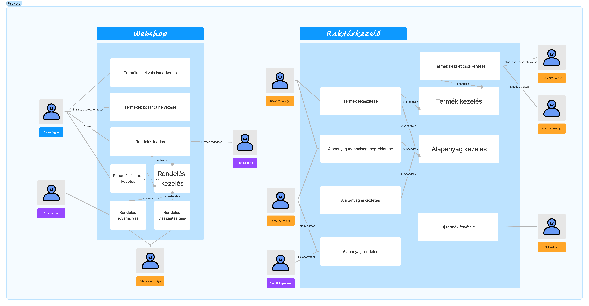

# Bella Croissant Lyonnass Projektterv `2024`

## 1. Összefoglaló 

Mi, franciák, nagyon büszkék vagyunk arra, hogy a baggettjeink finomak. Az ügyfél azzal az igénnyel fordult hozzánk, hogy átfogó üzletviteli rendszerre van szüksége. A rendszer főoldala egy publikusan látható webshop, ami mögött egy összetett rendszer található egy captive portálról elérhető. A vásárlók egy regisztráció után vásárolhatnak a kínálatból; a kollégák bejelentkezés után intézhetik az ügyviteli igényeiket. Az ügyviteli igények a következők: alapanyagok kezelése, termékek feltárása és mennyiségűk aktualizálása és legvégső soron a rendelések felügyelése és engedélyeztetése.

## 2. A projekt bemutatása

Ez a projektterv a Bella Croissant Lyonnass projektet mutatja be, amely 2024-9-25-től 2021-12-03-ig tart, azaz összesen 69 napon keresztül fog futni. A projekten hat fejlesztő fog dolgozni, az elvégzett feladatokat pedig négy alkalommal fogjuk prezentálni a megrendelőnek, annak érdekében, hogy biztosítsuk a projekt folyamatos előrehaladását. A projekt emellett folyamatos tesztkörnyezetben elérhető lesz az ügyfél számára egy [teszt környezet](https://bellacroissant.app.skornel02.hu/)ben a hatékony rugalmas fejlesztés érdekében.

### 2.1. Rendszerspecifikáció

A Bella Croissant Lyonnass cégnak egy átfogó ügyviteli rendszerre van szüksége ami több modulból áll.

Az elsődleges modul, amire a legnagyobb szükségük van, az egy webshop modul, amivel elérhetővé válik az ügyfelek számára az otthoni megrendelés funkció. Ezen funkció egy belépés nélküli főoldalt tartalmaz, ahol az összes termék látható. Ezen termékek kívánt mennyiségben egy kosárba helyezhető, és egy összefoglaló oldalon a rendelést leadhatjuk. A rendelés leadásához fiókra van szükség, ez piaci sztenderd módon kezelésre kerül. A fizetési folyamat túlmutat a rendszer igényein, ezért egy külső szolgáltató fogja ezt elvégezni a rendszerünk számára egy rugalmas integráción keresztül.

A webshop modulnak része egy adminisztratív felület, ahol a rendelések jóváhagyása és visszavonása történik. Ez egy egységes kaptív portálon keresztül elérhető, ahol a regisztrált felhasználók a megfelelő jogkörükhöz tartozó oldalt érhetik el. A leadott rendelések egy feltételezett raktármennyiség alapján automatizáltan követve vannak, viszont mivel az ügyfél emellett egy fizikai boltot is üzemeltet, így szükség van arra, hogy valaki kézzel engedélyezze az eladásokat. Amikor az eladás véglegesítve lett egy kolléga által, akkor az integrált futár szolgálat renderének jelezzük, hogy a csomag hova szállítandó.

Második fontos modul a rendszer hátterében lévő termelés és logisztikai terhek levétele az ügyfélről. Az első szintje ennek a rendszernek egy alapanyagok követésére tervezet rendszer, amely lehetővé teszi a raktáros kollégáknak, hogy az aktuális alapanyag szinteket nyomon kövesse és érkeztesse fizikailag és logikailag (aktualizálja a mennyiségűket a rendszerben) a megrendelt alapanyagokat. 
A szakács kollégák ezen rendszeren belül egy egyszerűsített felületet kapnak, ahol ők adott recepteket megtudnak valósítani. Ez azt segíti elő, hogy nem kell neki növelnie a termék raktár készletet, sem amortizálnia az alapanyag készletet, így automatizálva az ő adminisztratív munkáját. 
Elengedhetetlen funkció az is, hogy a séf tudja a létező termékeket kezelni, és újakat létrehozni. Ezek a termékek rendelkeznek a recepttel, amit a szakácsok eltudnak készíteni és ezek maguk azok a termékek amiket a vásárlók a webshoppon megtudnak rendelni.

A fizikai Bella Croissant Lyonnnass kiegészítő módulra tart igényt. A helyszíni kollégának adunk egy felületet, ahol a valós eladásokkal tudja a raktár készletet aktualizálni. 

A raktáras kollégának igénye lehet egy kiegészítő modulra, ami segíti az alapanyagok szinten tartását. Ha a kolléga látja, hogy az alapanyag szint megcsappan, akkor berendelést kezdeményezhet a saját felületéről. 

A vásárlók felületén is felmerült igény egy kiegészítő modul fejlesztésére. Ez a modul azt tartalmazza, hogy a vásárló látja a rendelésének az aktuális állapotát, egyenesen a rendeleés leadásától a házhoz szállítás pillanatáig. Ezt egy futárszolgálat integrálásával tehetjük meg.



### 2.2. Funkcionális követelmények

 - Adminisztratív felhasználók kezelése (kolléga, ügyfél) (CRUD) *szn: 4*
   - Administratív felület, ahol kolléga felvehető, szerkeszthető, törölhető
   - Áttekintő a regisztrált ügyfelekről
 - Felhasználói munkamenet megvalósítása több jogosultsági szinttel
   - Egységes bejelentkezési felület, ami jogosultság alapján a megfelelő helyre továbbít *szn: 2*
   - Regisztráció felhasználók számára
     - Vásárlás előtt *szn: 2*
     - Vásárlás közben *szn: 2*
 - Alapanyagok kezelése (CRUD) *szn: 8*
   - Táblázatos megjelenítése az adatoknak
   - Táblázatban inline sliderrel állítható raktárkészlet
   - Új alapnyag felvétele
   - Meglévő alapanyag szerkesztése
   - Meglévő alapanyag törlése
 - Termékek kezelése (CRUD) *szn: 8*
   - Táblázatos megjelenítés a termékekről, elérhető és lefoglalt mennyiség
   - Új termék létrehozása, alapinformációk
   - Termékek szerkesztése, alapinformációk
   - Termék törlése
 - Termékek alapanyag igényének karbantartása *szn: 4*
   - Termék szerkesztés kibővítése alapanyag meghatározással
 - Szakács felület elkészítése *szn: 6*
   - Elkészíthető termékek képpel való megjelenítése
   - Minden terméken gomb, ami a termék elkészítését kezdeményezi, mennyiség bekérővel.
 - Webshop felület elkészítése
   - Termékek megjelenítése kártyákban *szn: 2*
   - Termékek mellett termék szám bekérő és kosárhoz adás gomb *szn: 2*
   - Kosár felület, ahol a kosár tartalma látszódik *szn: 2*
   - Kosár felületen vásárlás leadása gomb *szn: 2*
   - Adatbekérő felület, ami nem regisztrált felhasználóktól jelszót is kér be (webshop mintára) *szn: 4*
   - Adatbekérő felület alján fizetési gombok *szn: 2*
   - Fizetés után a rendelés állapota oldal *szn: 2*
 - Rendelések állapota oldal  *szn: 2*
   - Belépett felhasználóknak egy lista ahol a rendeléseik láthatóak időrendben csökkenően, hogy milyen állapotban vannak
 - Webshop Értékesítő felület  *szn: 8*
   - Aktív, el nem fogadott rendelések megmutatása
   - Elfogadás gomb, ha a rendelés teljesíthető
   - Elutasítás gomb
   - Elfogadás esetén a termékek lefoglalásra kerülnek.
 - Fizikai értékesítő felület  *szn: 6*
   - Termékek listás megjelenítése
   - Minden termék mellett számbekérő
   - Oldal alján egy "Rendelés véglegesítése" gomb

### 2.3. Nem funkcionális követelmények

 - Reszponzív megjelenés
 - Az érzékeny adatokat biztonságosan tároljuk
 - Hosszú támogatási idővel rendelkező DotNet használata
 - Platform független futtatási környezet biztosítása
 - Projekt alapos tesztelése
   - Böngésző független működés
   - Teszt tervek felállítása

## 3. Költség- és erőforrás-szükségletek

Személyek száma: 7
szmély napok összesen: 119
Fejlesztés: 68

Az erőforrásigényünk összesen 119 személynap, átlagosan 17 $\frac{személynap}{fo}$.

A rendelkezésünkre áll összesen $3\cdot70=490$ pont.

## 4. Szervezeti felépítés és felelősségmegosztás

A projekt megrendelője XIV. Lajos. A Bella Croissant Lyonnass projektet a projektcsapat fogja végrehajtani, amely jelenleg hét fejlesztőből áll. A csapatban található tapasztalt és pályakezdő fejlesztő is, A tapasztalt projekttagok több éve dolgoznak az iparban, számos sikeres projektten vannak túl.
 - Farkas Dominika Eliza (15 millió év szoftverfejlesztői tapasztalat)
 - Gyenge Angéla (a kedvenc játéka a planning poker)
 - Horváth Gergely Zsolt (A pápa személyes programozója)
 - Pilter Zsófia (Az általa készített programozási nyelvben dolgozunk)
 - Stefán Kornél (Csak a világ harmadik legjobb szoftverfejlesztője)
 - Vad Avar (Említésre se méltó, mindenki tudja, hogy ért hozzá)
 - Vass Kinga (Véletlenül már megcsinálta ezt a projektet, de egy force pushban elveszett, tehát most együtt csináljuk újra, hogy tanuljunk tőle)

### 4.1 Projektcsapat

A projekt a következő emberekből áll:

| Név                      | Pozíció          |   E-mail cím (stud-os)      |
|--------------------------|------------------|-----------------------------|
| Stefán Kornél            | Projektmenedzser | h269206@stud.u-szeged.hu    |
| Farkas Dominika Eliza    | Projekt tag      | h355566@stud.u-szeged.hu    |
| Gyenge Angéla            | Projekt tag      | h158044@stud.u-szeged.hu    |
| Horváth Gergely Zsolt    | Projekt tag      | h262095@stud.u-szeged.hu    |
| Pilter Zsófia            | Projekt tag      | h268457@stud.u-szeged.hu    |
| Vad Avar                 | Projekt tag      | h270402@stud.u-szeged.hu    |
| Vass Kinga               | Projekt tag      | h270572@stud.u-szeged.hu    |

## 5. A munka feltételei

### 5.1. Munkakörnyezet

A projekt a következő munkaállomásokat fogja használni a munka során:

 - Fejlesztői Munkaállomások: Minden csapattag saját rendszere, Modern Windows operációs rendszerrel. Minimum követelményeknél a Visual Studio az iránymutató.
 - Kiszolgáló környezet: Dockerizált futattási környezt Alpine linux alapon. Minimum követelnmények: fél Gb memória és 1 processzor mag.

A projekt a következő technológiákat/szoftvereket fogja használni a munka során: 

 - Coolify platformszolgáltatás a webalkalmazás hosztolásához
 - Coolify által biztosított PostgreSQL adatbázisszerver
 - ASP.NET Core keretrendszer
 - Razor Pages dinamikus tartalom megjelenítés a felhasználói felületen
 - Visual Studio 2022 fejlesztőkörnyezet
 - Git verziókövető (GitLab)


### 5.2. Rizikómenedzsment

| Kockázat                                    | Leírás                                                                                                                                                                                     | Valószínűség | Hatás  |
|---------------------------------------------|--------------------------------------------------------------------------------------------------------------------------------------------------------------------------------------------|--------------|--------|
| `Betegség`                                  | `Súlyosságtól függően hátráltatja vagy bizonyos esetekben teljes mértékben korlátozza a munkavégzőt, így az egész projektre kihatással van. Megoldás: a feladatok átcsoportosítása`        | `nagy`       | `erős` |
| `Kommunikációs fennakadás a csapattagokkal` | `A csapattagok között nem elégséges az információ áramlás, nem pontosan, esetleg késve vagy nem egyértelműen tájékoztatjuk egymást. Megoldás: még gyakoribb megbeszélések és ellenőrzések` | `kis`        | `erős` |

```
A rizikótényezők bemutatása, amely hátráltathatja a projekt befejezését. 
Minden rizikót érdemes megemlíteni, részletezve, hogy mit jelent, 
milyen valószínűséggel következhet be (kis, közepes és nagy), 
mekkora a várható hatása (gyenge, közepes és erős) 
és hogy milyen tervvel készültök, amennyiben egy ilyen esemény bekövetkezik. 
Pl.: betegség, szoftver-hardver probléma, tag kiesése, extrém ZH időszak, pandémia, stb. 
```

## 6. Jelentések

### 6.1. Munka menedzsment
A munkát Stefán Kornél koordinálja. Fő feladata, hogy folyamatosan egyeztessen a csapattagokkal az előrehaladásról és a fellépő problémákról. A csapat rizikóért felelős vezetője Horváth Gergely. Feladatkörének része a lehetőséges rizikók feltárása és azok elhárítása. Fejlesztésminőségi felelős Vad Avar. A szoftver minőségét ő ellenőrzi és tartja magasra. A csapat adminisztratív vezetője Farkas Dominika. Ő végzi el a heti csoportgyűlések rögzítését. A csapat heti megbeszélései előre bejelentett időpontokban fognak történni, amelyről a Facebook szolgáltat értesítést.

### 6.2. Csoportgyűlések

A projekt hetente ülésezik, hogy megvitassák az azt megelőző hét problémáit, illetve hogy megbeszéljék a következő hét feladatait. A megbeszélésről minden esetben memó készül.

1. megbeszélés:
 - Időpont: 2021.09.18.
 - Hely: SZTE Irinyi épület - Szeged, Tisza Lajos krt. 103
 - Résztvevők: Horváth Gergely Zsolt, Pilter Zsófia, Stefán Kornél, Vad Avar, Vass Kinga
 - Érintett témák: Ismerkedés, projekttéma kiválasztása, technológia kiválasztása

2. megbeszélés:
 - Időpont: 2021.09.25.
 - Hely: SZTE Irinyi épület - Szeged, Tisza Lajos krt. 103
 - Résztvevők: Teljes csoport
 - Érintett témák: Ismerkedés 2, projekttéma végigtárgyalása, részletek kifejtése, technológiai eszközök feltárása.

### 6.3. Minőségbiztosítás

Az elkészült terveket a terveken nem dolgozó csapattársak közül átnézik, hogy megfelel-e a specifikációnak és az egyes diagramtípusok összhangban vannak-e egymással. A meglévő rendszerünk helyes működését a prototípusok bemutatása előtt a tesztelési dokumentumban leírtak végrehajtása alapján ellenőrizzük és összevetjük a specifikációval, hogy az elvárt eredményt kapjuk-e. További tesztelési lehetőségek: unit tesztek írása az egyes modulokhoz vagy a kód közös átnézése (code review) egy, a vizsgált modul programozásában nem résztvevő csapattaggal. Szoftverünk minőségét a végső leadás előtt javítani kell a rendszerünkre lefuttatott kódelemzés során kapott metrikaértékek és szabálysértések figyelembevételével.
Az alábbi lehetőségek vannak a szoftver megfelelő minőségének biztosítására:
- Specifikáció és tervek átnézése (kötelező)
- Teszttervek végrehajtása (kötelező)
- Unit tesztek írása (választható)
- Kód átnézése (választható)

### 6.4. Átadás, eredmények elfogadása

A projekt eredményeit a megrendelő, `Dr. Márkus András` fogja elfogadni. A projektterven változásokat csak a megrendelő írásos engedélyével lehet tenni. A projekt eredményesnek bizonyul, ha specifikáció helyes és határidőn belül készül el. Az esetleges késések pontlevonást eredményeznek. 
Az elfogadás feltételeire és beadás formájára vonatkozó részletes leírás a következő honlapon olvasható: https://okt.inf.szte.hu/rf1/

### 6.5. Státuszjelentés

Minden mérföldkő leadásnál a projekten dolgozók jelentést tesznek a mérföldkőben végzett munkájukról a a megadott sablon alapján. A gyakorlatvezetővel folytatott csapatmegbeszéléseken a csapat áttekintik és felmérik az eredményeket és teendőket. Továbbá gazdálkodnak az erőforrásokkal és szükség esetén a megrendelővel egyeztetnek a projektterv módosításáról.

## 7. A munka tartalma

### 7.1. Tervezett szoftverfolyamat modell és architektúra

`A szoftver fejlesztése során az agilis fejlesztési modellt alkalmazzuk, mivel a fejlesztés során nagy hangsúlyt fektetünk a folyamatos kommunikcióra. A fejlesztés során a szoftver specifikációi rugalmasan vátozhatnak, és ezzel a módszertannal tudunk a leggyorsabban alkalmazkodni az új elvárásokhoz.`

`A webalkalmazás az MVC (modell-view-controller) felépítést követi, a szerver és a kliens függetlenek, csupán API végpontok segítségével kommunikálnak.`

```
Milyen szoftverfolyamat modellt követve állítja elő a csapat a specifikációnak megfelelő prototípusokat? Miért ezt választja? 
A csapat milyen architektúrát választ a projekt megvalósításához? Milyen rétegek (logikai, adat, GUI) lesznek?`
```

### 7.2. Átadandók és határidők

A főbb átadandók és határidők a projekt időtartama alatt a következők:


| Szállítandó |                 Neve                                                        |   Határideje  |
|:-----------:|:---------------------------------------------------------------------------:|:-------------:|
|      D1     |      Projektterv és Gantt chart, prezentáció, egyéni jelentés               | `2021-10-04`  |
|    P1+D2    |      UML, adatbázis- és képernyőtervek, prezentáció, egyéni jelentés        | `2021-10-18`  |
|    P1+D3    |      Prototípus I. és tesztelési dokumentáció, egyéni jelentés              | `2021-11-08`  |
|    P2+D4    |      Prototípus II. és frissített tesztelési dokumentáció, egyéni jelentés  | `2021-11-27`  |

```
D - dokumentáció, P - prototípus
```

## 8. Feladatlista

A következőkben a tervezett feladatok részletes összefoglalása található.

```
Alapvetően egy feladatnak 1 felelőse lehet, de kivételt képez pl. a 9.1.1. részfeladat, mivel az első mérföldkőben
2 kötelező feladat van, ezt nem bontjuk részfeladatokra.
```

### 8.1. Projektterv (1. mérföldkő)

Ennek a feladatnak az a célja, hogy `megvalósításhoz szükséges lépéseket, az erőforrásigényeket, az ütemezést, a felelősöket és a feladatok sorrendjét meghatározzuk, majd vizualizáljuk Gantt diagram segítségével.`

Részfeladatai a következők:

#### 8.1.1. Projektterv kitöltése

Felelős: `Mindenki`

Tartam:  `4 nap`

Erőforrásigény:  `1 személynap/fő`


#### 8.1.2. Bemutató elkészítése

Felelős: `Teszt Elek`

Tartam:  `2 nap`

Erőforrásigény:  `0.5 személynap`

```
A mérföldkőhöz tartozó feladatok bemutatása PPT keretében, pl. téma, tervezett funkciók, tagok, Gantt diagram.`
```

### 8.2. UML és adatbázis- és képernyőtervek (2. mérföldkő)

Ennek a feladatnak az a célja, hogy `a rendszerarchitektúrát, az adatbázist és webalkalmazás kinézetét megtervezzük.`

Részfeladatai a következők:

#### 8.2.1. Use Case diagram

Felelős: `Teszt Elek`

Tartam:  `3 nap`

Erőforrásigény:  `1 személynap`

#### 8.2.2. Class diagram

Felelős: `Lev Elek`

Tartam:  `4 nap`

Erőforrásigény:  `2 személynap`

#### 8.2.3. Sequence diagram

Felelős: `Remek Elek`

Tartam:  `3 nap`

Erőforrásigény:  `2 személynap`

#### 8.2.4. Egyed-kapcsolat diagram adatbázishoz

Felelős: `Remek Elek`

Tartam:  `4 nap`

Erőforrásigény:  `2 személynap`

#### 8.2.5. Package diagram

Felelős: `Teszt Elek`

Tartam:  `3 nap`

Erőforrásigény:  `0.5 személynap`

#### 8.2.6. Képernyőtervek

Felelős: `Teszt Elek`

Tartam:  `3 nap`

Erőforrásigény:  `1 személynap`

#### 8.2.7. Bemutató elkészítése

Felelős: `Lev Elek`

Tartam:  `1 nap`

Erőforrásigény:  `0.5 személynap`

```
A mérföldkőhöz tartozó feladatok bemutatása PPT keretében (elkészült diagramok és képernyőtervek)`
```

### 8.3. Prototípus I. (3. mérföldkő)

Ennek a feladatnak az a célja, hogy `egy működő prototípust hozzunk létre, ahol a vállalt funkcionális követelmények nagy része már prezentálható állapotban van.` 

Részfeladatai a következők:

#### `8.3.1. Felhasználók kezelése (admin, raktáros, sofőr) (CR)`

Felelős: `Teszt Elek`

Tartam:  `5 nap`

Erőforrásigény:  `2 személynap`

#### `8.3.2. Felhasználók kezelése (admin, raktáros, sofőr) (UD)`

Felelős: `Remek Elek`

Tartam:  `4 nap`

Erőforrásigény:  `2 személynap`

#### `8.3.3. Felhasználók kezeléséhez szükséges adatok létrehozása az adatbázisban`

Felelős: `Lev Elek`

Tartam:  `3 nap`

Erőforrásigény:  `1 személynap`

#### `8.3.4. Felhasználói munkamenet megvalósítása több jogosultsági szinttel`

Felelős: `Teszt Elek `

Tartam:  `10 nap`

Erőforrásigény:  `2 személynap`

#### `8.3.5. Raktárak kezelése (CRUD)`

Felelős: `Teszt Elek`

Tartam:  `3 nap`

Erőforrásigény:  `1 személynap`

#### `8.3.6. Raktárkezeléshez szükséges adatok létrehozása az adatbázisban`

Felelős: `Remek Elek`

Tartam:  `4 nap`

Erőforrásigény:  `2 személynap`

#### `8.3.7. Árukészletek kezelése (C)`

Felelős: `Remek Elek `

Tartam:  `4 nap`

Erőforrásigény:  `2 személynap`

#### `8.3.8. Árukészletek kezelése (R)`

Felelős: `Lev Elek`

Tartam:  `3 nap`

Erőforrásigény:  `1 személynap`

#### `8.3.9. Árukészletek kezelése (UD)`

Felelős: `Lev Elek`

Tartam:  `5 nap`

Erőforrásigény:  `2 személynap`

#### `8.3.10. Árukészletek kezeléséhez szükséges adatok létrehozása az adatbázisban`

Felelős: `Lev Elek`

Tartam:  `5 nap`

Erőforrásigény:  `2 személynap`

#### `8.3.11. Járművek kezelése (CRUD) és a szükséges adatok létrehozása az adatbázisban`

Felelős: `Lev Elek`

Tartam:  `3 nap`

Erőforrásigény:  `2 személynap`

#### `8.3.12. Fuvarok/szállítmányok kezelése (CR)`

Felelős: `Teszt Elek`

Tartam:  `4 nap`

Erőforrásigény:  `2 személynap`

#### `8.3.13. Fuvarok/szállítmányok kezelése (UD)`

Felelős: `Teszt Elek `

Tartam:  `5 nap`

Erőforrásigény:  `2 személynap`

#### `8.3.14. Fuvarok/szállítmányok szükséges adatok létrehozása az adatbázisban`

Felelős: `Remek Elek `

Tartam:  `3 nap`

Erőforrásigény:  `1 személynap`

#### `8.3.15. Email-es kiértesítés új szállítmány esetén az adott raktárosnak és sofőrnek`

Felelős: `Remek Elek`

Tartam:  `4 nap`

Erőforrásigény:  `2 személynap`

#### `8.3.16. Fuvar útvonalának megjelenítése térképen a kezdő és a végponttal együtt`

Felelős: `Remek Elek`

Tartam:  `5 nap`

Erőforrásigény:  `3 személynap`

#### `8.3.17. Biztonsági mentés automatikus létrehozása`

Felelős: `Lev Elek`

Tartam:  `3 nap`

Erőforrásigény:  `1 személynap`

#### 8.3.18. Tesztelési dokumentum az összes funkcióhoz (TP, TC)

Felelős: `Mindenki`

Tartam:  `7 nap`

Erőforrásigény:  `1 személynap/fő`

```
Itt csak a könnyebb áttekinthetőség végett szerepel mindenki felelősként, azonban ezt a feladatot is részfeladatokra kell bontani.
```

#### `8.3.19. A prototípus kitelepítése éles környezetbe` 

Felelős: `Teszt Elek`

Tartam:  `1 nap`

Erőforrásigény:  `1 személynap`

```
A feladatokat a 2.2-es és a 2.3-as pont alapján kell meghatározni és lehető legrészletesebben definiálni.
Lehetőség szerint az összetett feladatokat bontsuk fel részfeladatokra. 
A bemutató során a prototípus aktuális állását kell prezentálni.
```

### 8.4. Prototípus II. (4. mérföldkő)

Ennek a feladatnak az a célja, hogy `az előző mérföldkő hiányzó funkcióit pótoljuk, illetve a hibásan működő funkciókat és az esetlegesen felmerülő új funkciókat megvalósítsuk. Továbbá az alkalmazás alapos tesztelése is a mérföldkőben történik az előző mérföldkőben összeállított tesztesetek alapján.`

Részfeladatai a következők:

#### 8.4.1. Javított minőségű prototípus új funkciókkal

Felelős: `Teszt Elek`

Tartam:  `5 nap`

Erőforrásigény:  `2.5 személynap`

#### 8.4.2. Javított minőségű prototípus javított funkciókkal

Felelős: `Lev Elek`

Tartam:  `5 nap`

Erőforrásigény:  `2 személynap`

#### 8.4.3. Javított minőségű prototípus a korábbi hiányzó funkciókkal

Felelős: `Remek Elek`

Tartam:  `5 nap`

Erőforrásigény:  `1.5 személynap`

#### `8.4.4. Felhasználói munkamenet tesztelése (TR)`

Felelős: `Teszt Elek`

Tartam:  `1 nap`

Erőforrásigény:  `1 személynap`

#### `8.4.5. Raktárak kezelésének tesztelése (TR)`

Felelős: `Remek Elek`

Tartam:  `1 nap`

Erőforrásigény:  `0.5 személynap`

#### `8.4.6. Árukészletek kezelésének tesztelése (TR)`

Felelős: `Teszt Elek`

Tartam:  `1 nap`

Erőforrásigény:  `1 személynap`

#### `8.4.7. Járművek kezelésének tesztelése (TR)`

Felelős: `Remek Elek`

Tartam:  `1 nap`

Erőforrásigény:  `0.5 személynap`

#### `8.4.8. Fuvarok kezelésének tesztelése (TR)`

Felelős: `Lev Elek`

Tartam:  `1 nap`

Erőforrásigény:  `0.5 személynap`

#### `8.4.9. Email-es funkciók tesztelése (TR)`

Felelős: `Remek Elek`

Tartam:  `1 nap`

Erőforrásigény:  `0.5 személynap`

#### `8.4.10. Térképes funkciók tesztelése (TR)`

Felelős: `Lev Elek`

Tartam:  `1 nap`

Erőforrásigény:  `0.5 személynap`

#### `8.4.11. Biztonsági mentés tesztelése (TR)`

Felelős: `Lev Elek`

Tartam:  `1 nap`

Erőforrásigény:  `0.5 személynap`

#### `8.4.12. A prototípus kitelepítésének frissítése`

Felelős: `Teszt Elek`

Tartam:  `1 nap`

Erőforrásigény:  `0.5 személynap`

```
Működő végleges program, a frissített tesztelési dokumentációval. A 3. mérföldkőhöz képest funkiconálisan többet kell tudnia az oldalnak.

```
## 9. Részletes időbeosztás


```
Ide kell berakni a Gantt diagramot, amely a 9. fejezetben található részfeladatokat tartalmazza felelős/tartam bontásban.
```

## 10. Projekt költségvetés

```
Az egyes leadások alkalmával rögzített erőforrásigényt, az elvállalt feladatok számát 
és az adott mérföldkőben végzett munkáért szerezhető pontszámot kell beírni minden emberre külön-külön.
Figyeljünk arra, hogy mivel mindenkinek minden mérföldkövön dolgoznia kell, ezért a 10.3-as táblázat
minden módosítható oszlopában legalább 1 pontnak szerepelni kell.
```

### 10.1. Részletes erőforrásigény (személynap)


| Név          |   M1  |   M2  |   M3 |   M4  | Összesen |
|--------------|-------|-------|------|-------|----------|
| `Teszt Elek` | `1.5` | `1.5` | `11` | `5`   | `19`     |
| `Remek Elek` | `1`   | `4`   | `13` | `3`   | `21`     |
| `Lev Elek`   | `1`   | `2.5` | `10` | `3.5` | `17`     |


### 10.2. Részletes feladatszámok

| Név          |   M1  |   M2  |   M3 |   M4 | Összesen |
|--------------|-------|-------|------|------|----------|
| `Teszt Elek` | `2`   | `2`   | `7`  | `4`  | `15`     |
| `Remek Elek` | `1`   | `2`   | `7`  | `4`  | `14`     |
| `Lev Elek`   | `1`   | `2`   | `7`  | `4`  | `14`     |

### 10.3. Részletes költségvetés

| Név                                 | M1      | M2       | M3       | M4       | Összesen  |
|-------------------------------------|---------|----------|----------|----------|-----------|
| Maximálisan megszerezhető pontszám  |  (7)    | (20)     | (35)     |  (28)    | 100% (70) |
| `Teszt Elek`                        | `7`     | `10`     | `28`     |  `25`    | 70        |
| `Remek Elek`                        | `4`     | `15`     | `35`     |  `16`    | 70        |
| `Lev Elek`                          | `4`     | `12`     | `30`     |  `24`    | 70        |

Szeged, `2021-10-25`.