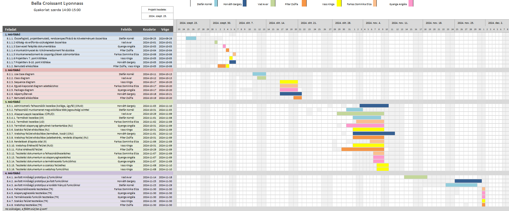

# Bella Croissant Lyonnass Projektterv 2024

---

## 1. Összefoglaló 

Mi, franciák, nagyon büszkék vagyunk arra, hogy a baggettjeink finomak. Az ügyfél azzal az igénnyel fordult hozzánk, hogy átfogó üzletviteli rendszerre van szüksége. A rendszer főoldala egy publikusan látható webshop. Mögötte egy összetett rendszer található, ami egy captive portálról érhető el. A vásárlók regisztráció után vásárolhatnak a kínálatból; a kollégák bejelentkezés után intézhetik az ügyviteli igényeiket. Az ügyviteli igények a következők: alapanyagok kezelése, termékek feltárása és mennyiségük aktualizálása és legvégső soron a rendelések felügyelése és engedélyeztetése.

## 2. A projekt bemutatása

Ez a projektterv a Bella Croissant Lyonnass projektet mutatja be, amely 2024-9-25-től 2024-12-03-ig tart, azaz összesen 69 napon keresztül fog futni. A projekten hat fejlesztő fog dolgozni, az elvégzett feladatokat pedig négy alkalommal fogjuk prezentálni a megrendelőnek, annak érdekében, hogy biztosítsuk a projekt folyamatos előrehaladását. A projekt emellett folyamatos tesztkörnyezetben elérhető lesz az ügyfél számára egy [teszt környezet](https://bellacroissant.app.skornel02.hu/)ben a hatékony és rugalmas fejlesztés érdekében.

### 2.1. Rendszerspecifikáció

A Bella Croissant Lyonnass cégnak egy átfogó ügyviteli rendszerre van szüksége ami több modulból áll.

Az elsődleges modul, amire a legnagyobb szükségük van, egy webshop modul, amivel elérhetővé válik az ügyfelek számára az otthoni megrendelés funkció. Ezen funkció egy belépés nélküli főoldalt tartalmaz, ahol az összes termék látható. Ezen termékek kívánt mennyiségben kosárba helyezhetőek, és a rendelés leadható egy összefoglaló oldalon. A rendelés leadásához fiókra van szükség, ez piaci sztenderd módon kezelésre kerül. A fizetési folyamat túlmutat a rendszer igényein, ezért egy külső szolgáltató fogja ezt elvégezni a rendszerünk számára egy rugalmas integráción keresztül.

A webshop modulnak része egy adminisztratív felület, ahol a rendelések jóváhagyása és visszavonása történik. Ez egy egységes kaptív portálon keresztül elérhető, ahol a regisztrált felhasználók a megfelelő jogkörükhöz tartozó oldalt érhetik el. A leadott rendelések egy feltételezett raktármennyiség alapján automatizáltan követve vannak, viszont mivel az ügyfél emellett egy fizikai boltot is üzemeltet, így szükség van arra, hogy valaki kézzel engedélyezze az eladásokat. Amikor az eladás véglegesítve lett egy kolléga által, akkor az integrált futár szolgálat rendszerének jelezzük, hogy a csomag hova szállítandó.

Második fontos modul a rendszer hátterében lévő termelés és logisztikai terhek levétele az ügyfélről. Az első szintje ennek a rendszernek egy alapanyagok követésére tervezett rendszer, amely lehetővé teszi a raktáros kollégáknak, hogy az aktuális alapanyag szinteket nyomon kövesse és érkeztesse fizikailag és logikailag (aktualizálja a mennyiségüket a rendszerben) a megrendelt alapanyagokat. 
A szakács kollégák ezen rendszeren belül egy egyszerűsített felületet kapnak, ahol ők adott recepteket megtudnak valósítani. Ez azt segíti elő, hogy nem kell neki növelnie a termék raktár készletet, sem amortizálnia az alapanyag készletet, így automatizálva az ő adminisztratív munkáját. 
Elengedhetetlen funkció az is, hogy a séf tudja a létező termékeket kezelni, és újakat létrehozni. Ezek a termékek rendelkeznek a recepttel, amit a szakácsok eltudnak készíteni és ezek maguk azok a termékek amiket a vásárlók a webshoppon megtudnak rendelni.

A fizikai Bella Croissant Lyonnnass kiegészítő modulra tart igényt. A helyszíni kollégának adunk egy felületet, ahol a valós eladásokkal tudja a raktár készletet aktualizálni. 

A raktáras kollégának igénye lehet egy kiegészítő modulra, ami segíti az alapanyagok szinten tartását. Ha a kolléga látja, hogy az alapanyag szint megcsappan, akkor berendelést kezdeményezhet a saját felületéről. 

A vásárlók felületén is felmerült igény egy kiegészítő modul fejlesztésére. Ez a modul azt tartalmazza, hogy a vásárló látja a rendelésének az aktuális állapotát, egyenesen a rendelés leadásától a házhoz szállítás pillanatáig. Ezt egy futárszolgálat integrálásával tehetjük meg.

### 2.2. Funkcionális követelmények

 - Adminisztratív felhasználók kezelése (kolléga, ügyfél) (CRUD)
   - Administratív felület, ahol kolléga felvehető, szerkeszthető, törölhető
   - Áttekintő a regisztrált ügyfelekről
 - Felhasználói munkamenet megvalósítása több jogosultsági szinttel
   - Egységes bejelentkezési felület, ami jogosultság alapján a megfelelő helyre továbbít
   - Regisztráció felhasználók számára
     - Vásárlás előtt
     - Vásárlás közben
 - Alapanyagok kezelése (CRUD)
   - Táblázatos megjelenítése az adatoknak
   - Táblázatban inline sliderrel állítható raktárkészlet
   - Új alapnyag felvétele
   - Meglévő alapanyag szerkesztése
   - Meglévő alapanyag törlése
 - Termékek kezelése (CRUD)
   - Táblázatos megjelenítés a termékekről, elérhető és lefoglalt mennyiség
   - Új termék létrehozása, alapinformációk
   - Termékek szerkesztése, alapinformációk
   - Termék törlése
 - Termékek alapanyag igényének karbantartása
   - Termék szerkesztés kibővítése alapanyag meghatározással
 - Szakács felület elkészítése
   - Elkészíthető termékek képpel való megjelenítése
   - Minden terméken gomb, ami a termék elkészítését kezdeményezi, mennyiség bekérővel.
 - Webshop felület elkészítése
   - Termékek megjelenítése kártyákban
   - Termékek mellett termék szám bekérő és kosárhoz adás gomb
   - Kosár felület, ahol a kosár tartalma látszódik
   - Kosár felületen vásárlás leadása gomb
   - Adatbekérő felület, ami nem regisztrált felhasználóktól jelszót is kér be (webshop mintára)
   - Adatbekérő felület alján fizetési gombok
   - Fizetés után a rendelés állapota oldal
 - Rendelések állapota oldal
   - Belépett felhasználóknak egy lista ahol a rendeléseik láthatóak időrendben csökkenően, hogy milyen állapotban vannak
 - Webshop Értékesítő felület
   - Aktív, el nem fogadott rendelések megmutatása
   - Elfogadás gomb, ha a rendelés teljesíthető
   - Elutasítás gomb
   - Elfogadás esetén a termékek lefoglalásra kerülnek.
 - Fizikai értékesítő felület
   - Termékek listás megjelenítése
   - Minden termék mellett számbekérő
   - Oldal alján egy "Rendelés véglegesítése" gomb

### 2.3. Nem funkcionális követelmények

 - Reszponzív megjelenés
 - Az érzékeny adatokat biztonságosan tároljuk
 - Hosszú támogatási idővel rendelkező DotNet használata
 - Platform független futtatási környezet biztosítása
 - Projekt alapos tesztelése
   - Böngésző független működés
   - Teszt tervek felállítása

## 3. Költség- és erőforrás-szükségletek

- Személyek száma: 7
- Személy napok összesen: 139
- Fejlesztés: 68

Az erőforrásigényünk összesen 139 személynap, átlagosan 19 $\frac{személynap}{fo}$.

A rendelkezésünkre áll összesen $7\cdot70=490$ pont.

## 4. Szervezeti felépítés és felelősségmegosztás

A projekt megrendelője XIV. Lajos. A Bella Croissant Lyonnass projektet a projektcsapat fogja végrehajtani, amely jelenleg hét fejlesztőből áll. A csapatban található tapasztalt és pályakezdő fejlesztő is, A tapasztalt projekttagok több éve dolgoznak az iparban, számos sikeres projektten vannak túl.
 - Farkas Dominika Eliza (15 millió év szoftverfejlesztői tapasztalat)
 - Gyenge Angéla (a kedvenc játéka a planning poker)
 - Horváth Gergely Zsolt (A pápa személyes programozója)
 - Pilter Zsófia (Az általa készített programozási nyelvben dolgozunk)
 - Stefán Kornél (Csak a világ harmadik legjobb szoftverfejlesztője)
 - Vad Avar (Említésre se méltó, mindenki tudja, hogy ért hozzá)
 - Vass Kinga (Véletlenül már megcsinálta ezt a projektet, de egy force pushban elveszett, tehát most együtt csináljuk újra, hogy tanuljunk tőle)

### 4.1 Projektcsapat

A projekt a következő emberekből áll:

| Név                      | Pozíció          |   E-mail cím (stud-os)      |
|--------------------------|------------------|-----------------------------|
| Stefán Kornél            | Projektmenedzser | h269206@stud.u-szeged.hu    |
| Farkas Dominika Eliza    | Projekt tag      | h355566@stud.u-szeged.hu    |
| Gyenge Angéla            | Projekt tag      | h158044@stud.u-szeged.hu    |
| Horváth Gergely Zsolt    | Projekt tag      | h262095@stud.u-szeged.hu    |
| Pilter Zsófia            | Projekt tag      | h268457@stud.u-szeged.hu    |
| Vad Avar                 | Projekt tag      | h270402@stud.u-szeged.hu    |
| Vass Kinga               | Projekt tag      | h270572@stud.u-szeged.hu    |

## 5. A munka feltételei

### 5.1. Munkakörnyezet

A projekt a következő munkaállomásokat fogja használni a munka során:

 - Fejlesztői Munkaállomások: Minden csapattag saját rendszere, Modern Windows operációs rendszerrel. Minimum követelményeknél a Visual Studio az iránymutató.
 - Kiszolgáló környezet: Dockerizált futattási környezt Alpine linux alapon. Minimum követelmények: fél Gb memória és 1 processzor mag.

A projekt a következő technológiákat/szoftvereket fogja használni a munka során: 

 - Coolify platformszolgáltatás a webalkalmazás hosztolásához
 - Coolify által biztosított PostgreSQL adatbázisszerver
 - ASP.NET Core keretrendszer
 - Razor Pages dinamikus tartalom megjelenítés a felhasználói felületen
 - Visual Studio 2022 fejlesztőkörnyezet
 - Git verziókövető (GitLab)

### 5.2. Rizikómenedzsment

| Kockázat                                    | Leírás                                                                                                                                                                                     | Valószínűség | Hatás  |
|---------------------------------------------|--------------------------------------------------------------------------------------------------------------------------------------------------------------------------------------------|--------------|--------|
| Áramkimaradás csapattagnál                  | Súlyosságtól függően hátráltatja vagy bizonyos esetekben teljes mértékben korlátozza a munkavégzőt, így az egész projektre kihatással van. Megoldás: a feladatok átcsoportosítása          | kis          | erős   |
| Áramütés éri egy csapattagot                      | Hosszútávú hatással lehet az adott csapattag munkavégzésére. Megoldás: biztonsági előírások betartása.     | kis         | nagy    |
| Kommunikációs fennakadás a csapattagokkal   | A csapattagok között nem elégséges az információ áramlás, nem pontosan, esetleg késve vagy nem egyértelműen tájékoztatjuk egymást. Megoldás: még gyakoribb megbeszélések és ellenőrzések   | közepes      | erős   |
| Sűrű szorgalmi időszak                      | Adott csapattag terhelése bizonyos időszakokban erősen növekedhet, ami kihatással lehet a munkavégzésre. Megoldás: gyakori egyeztetés és a feladatok szükség szerinti átcsoportosítása     | nagy         | kis    |
| Meteor csapódik be Szegedbe                      | Katasztrofális hatása lenne az egész csapata mukavégzési képességeire és a morálra is.     | kis         | nagy    |
| Elszabadulnak a dínók                      | A futás közben való programozás negatív hatással lehet a koncentrációra, így kihatással lehet a kód minőségére. Megoldás: hangsúly fektetése a tesztelésre.     | közepes         | közepes    |
| Átállás online oktatásra                      | Az órák utáni személyes megbeszéléseket felborítaná. Megoldás: megbeszélések áthelyezése online térbe     | kis         | kis    |

## 6. Jelentések

### 6.1. Munka menedzsment
A munkát Stefán Kornél koordinálja. Fő feladata, hogy folyamatosan egyeztessen a csapattagokkal az előrehaladásról és a fellépő problémákról. A csapat rizikóért felelős vezetője Horváth Gergely. Feladatkörének része a lehetőséges rizikók feltárása és azok elhárítása. Fejlesztésminőségi felelős Vad Avar. A szoftver minőségét ő ellenőrzi és tartja magasra. A csapat adminisztratív vezetője Farkas Dominika. Ő végzi el a heti csoportgyűlések rögzítését. A csapat heti megbeszélései előre bejelentett időpontokban fognak történni, amelyről a Facebook szolgáltat értesítést.

### 6.2. Csoportgyűlések

A projekt hetente ülésezik, hogy megvitassák az azt megelőző hét problémáit, illetve hogy megbeszéljék a következő hét feladatait. A megbeszélésről minden esetben memó készül.

1. megbeszélés:
 - Időpont: 2021.09.18.
 - Hely: SZTE Irinyi épület - Szeged, Tisza Lajos krt. 103
 - Résztvevők: Horváth Gergely Zsolt, Pilter Zsófia, Stefán Kornél, Vad Avar, Vass Kinga
 - Érintett témák: Ismerkedés, projekttéma kiválasztása, technológia kiválasztása

2. megbeszélés:
 - Időpont: 2021.09.25.
 - Hely: SZTE Irinyi épület - Szeged, Tisza Lajos krt. 103
 - Résztvevők: Teljes csoport
 - Érintett témák: Ismerkedés 2, projekttéma végigtárgyalása, részletek kifejtése, technológiai eszközök feltárása.

3. megbeszélés:
 - Időpont: 2021.10.02.
 - Hely: SZTE Irinyi épület - Szeged, Tisza Lajos krt. 103
 - Résztvevők: Horváth Gergely Zsolt, Pilter Zsófia, Vad Avar, Vass Kinga, Gyenge Angéla
 - Érintett témák: Git használati szabályok (merge requestek) megbeszélése 

### 6.3. Minőségbiztosítás

Az elkészült terveket a terveken nem dolgozó csapattársak közül átnézik, hogy megfelel-e a specifikációnak és az egyes diagramtípusok összhangban vannak-e egymással. A meglévő rendszerünk helyes működését a prototípusok bemutatása előtt a tesztelési dokumentumban leírtak végrehajtása alapján ellenőrizzük és összevetjük a specifikációval, hogy az elvárt eredményt kapjuk-e. További tesztelési lehetőségek: unit tesztek írása az egyes modulokhoz vagy a kód közös átnézése (code review) egy, a vizsgált modul programozásában nem résztvevő csapattaggal. Szoftverünk minőségét a végső leadás előtt javítani kell a rendszerünkre lefuttatott kódelemzés során kapott metrikaértékek és szabálysértések figyelembevételével.
Az alábbi lehetőségek vannak a szoftver megfelelő minőségének biztosítására:
- Specifikáció és tervek átnézése (kötelező)
- Teszttervek végrehajtása (kötelező)
- Unit tesztek írása (választható)
- Kód átnézése (választható)

### 6.4. Átadás, eredmények elfogadása

A projekt eredményeit a megrendelő, XIV. Lajos fogja elfogadni. A projektterven változásokat csak a megrendelő írásos engedélyével lehet tenni. A projekt eredményesnek bizonyul, ha specifikáció helyes és határidőn belül készül el. Az esetleges késések pontlevonást eredményeznek. 
Az elfogadás feltételeire és beadás formájára vonatkozó részletes leírás a következő honlapon olvasható: https://okt.inf.szte.hu/rf1/

### 6.5. Státuszjelentés

Minden mérföldkő leadásnál a projekten dolgozók jelentést tesznek a mérföldkőben végzett munkájukról a megadott sablon alapján. A gyakorlatvezetővel folytatott csapatmegbeszéléseken a csapat áttekintik és felmérik az eredményeket és teendőket. Továbbá gazdálkodnak az erőforrásokkal és szükség esetén a megrendelővel egyeztetnek a projektterv módosításáról.

## 7. A munka tartalma

### 7.1. Tervezett szoftverfolyamat modell és architektúra

A szoftver fejlesztése során az agilis fejlesztési modellt alkalmazzuk, mivel a fejlesztés során nagy hangsúlyt fektetünk a folyamatos kommunikcióra. Ezzel a módszertannal biztosítani tudjuk a csapat és a megrendelő közti folyamatos kommunikciót és visszajelzés-áramlást.

A rendszerünk egy több rétegű modern webalkalmazás mintájára készül. A program rendszerünk alapköve a felhasználóknál megtalálható böngésző, ami a kliens szerepét fogja betölteni. A kiszolgáló egy alkalmazott MVC paradigmának megfelelően a Razor Pages technológiával lesz megvalósítva. Az adatokat egy PostgresQL adatbázisban fogjuk tárolni, amivel csak a kiszolgáló veszi fel a kapcsolatot.

### 7.2. Átadandók és határidők

A főbb átadandók és határidők a projekt időtartama alatt a következők:

| Szállítandó |                 Neve                                                        |   Határideje  |
|:-----------:|:---------------------------------------------------------------------------:|:-------------:|
|      D1     |      Projektterv és Gantt chart, prezentáció, egyéni jelentés               | 2024-10-07  |
|    P1+D2    |      UML, adatbázis- és képernyőtervek, prezentáció, egyéni jelentés        | 2024-10-21  |
|    P1+D3    |      Prototípus I. és tesztelési dokumentáció, egyéni jelentés              | 2024-11-11  |
|    P2+D4    |      Prototípus II. és frissített tesztelési dokumentáció, egyéni jelentés  | 2024-12-02  |

## 8. Feladatlista

A következőkben a tervezett feladatok részletes összefoglalása található.

### 8.1. Projektterv (1. mérföldkő)

Ennek a feladatnak az a célja, hogy a megvalósításhoz szükséges lépéseket, az erőforrásigényeket, az ütemezést, a felelősöket és a feladatok sorrendjét meghatározzuk, majd vizualizáljuk Gantt diagram segítségével.

Részfeladatai a következők:

#### 8.1.1.1 Összefoglaló, projektbemutató, rendszerspecifikáció és követelmények összeírása

Felelős: Stefán Kornél

Tartam:  2 nap

Erőforrásigény:  1 személynap

#### 8.1.1.2 Költség- és erőforrás-szükségletek összeírása

Felelős: Vad Avar

Tartam:  1 nap

Erőforrásigény:  1 személynap

#### 8.1.1.3 Szervezeti felépítés dokumentálása

Felelős: Gyenge Angéla

Tartam:  1 nap

Erőforrásigény:  1 személynap

#### 8.1.1.4 Munkakörnyezet és rizikómenedzsment felvázolása

Felelős: Pilter Zsófia

Tartam:  1 nap

Erőforrásigény:  1 személynap

#### 8.1.1.5 Munkamenedzsment és csoportgyűlések számontartása

Felelős: Farkas Dominika Eliza

Tartam:  1 nap

Erőforrásigény:  1 személynap

#### 8.1.1.6 Projektterv 7. pont kitöltése

Felelős: Vass Kinga

Tartam:  1 nap

Erőforrásigény:  1 személynap

#### 8.1.1.7 Projektterv 8-10. pont kitöltése

Felelős: Horváth Gergely Zsolt

Tartam:  2 nap

Erőforrásigény:  1 személynap

#### 8.1.2. Bemutató elkészítése

Felelős: Vass Kinga, Pilter Zsófia

Tartam:  2 nap

Erőforrásigény:  0.5 személynap/fő

### 8.2. UML és adatbázis- és képernyőtervek (2. mérföldkő)

Ennek a feladatnak az a célja, hogy a rendszerarchitektúrát, az adatbázist és webalkalmazás kinézetét megtervezzük.

Részfeladatai a következők:

#### 8.2.1. Use Case diagram

Felelős: Stefán Kornél

Tartam:  3 nap

Erőforrásigény:  1 személynap

#### 8.2.2. Class diagram

Felelős: Vad Avar

Tartam:  2 nap

Erőforrásigény:  2 személynap

#### 8.2.3. Sequence diagram

Felelős: Vass Kinga

Tartam:  4 nap

Erőforrásigény:  4 személynap

#### 8.2.4. Egyed-kapcsolat diagram adatbázishoz

Felelős: Farkas Dominika Eliza

Tartam:  4 nap

Erőforrásigény:  4 személynap

#### 8.2.5. Package diagram

Felelős: Gyenge Angéla

Tartam:  4 nap

Erőforrásigény:  4 személynap

#### 8.2.6. Képernyőtervek

Felelős: Horváth Gergely

Tartam:  4 nap

Erőforrásigény:  3 személynap

#### 8.2.7. Bemutató elkészítése

Felelős: Pilter Zsófia

Tartam:  2 nap

Erőforrásigény:  2 személynap

### 8.3. Prototípus I. (3. mérföldkő)

A feladat célja egy prezentálható prototípus létrehozása, demózható állapotú funkiconalitással.

Részfeladatai a következők:

#### 8.3.1. Adminisztratív felhasználók kezelése (kolléga, ügyfél) (CRUD)

Felelős: Horváth Gergely

Tartam:  8 nap

Erőforrásigény:  4 személynap

#### 8.3.2. Felhasználói munkamenet megvalósítása több jogosultsági szinttel

Felelős: Stefán Kornél

Tartam:  4 nap

Erőforrásigény:  4 személynap

#### 8.3.3. Alapanyagok kezelése (CRUD)

Felelős: Vad Avar

Tartam:  12 nap

Erőforrásigény:  8 személynap

#### 8.3.4.1 Termékek kezelése (CR)

Felelős: Stefán Kornél

Tartam:  8 nap

Erőforrásigény:  8 személynap

#### 8.3.4.2 Termékek kezelése (UD)

Felelős: Farkas Dominika Eliza

Tartam:  8 nap

Erőforrásigény:  8 személynap

#### 8.3.5. Termékek alapanyag igényének karbantartása (RU)

Felelős: Gyenge Angéla

Tartam:  10 nap

Erőforrásigény:  8 személynap

#### 8.3.6. Szakács felület elkészítése (RU)

Felelős: Vass Kinga

Tartam:  10 nap

Erőforrásigény:  6 személynap

#### 8.3.7. Webshop felület elkészítése (termékek, kosár) (CRU)

Felelős: Horváth Gergely

Tartam:  10 nap

Erőforrásigény:  8 személynap

#### 8.3.8. Webshop felület elkészítése (adatbekérés, rendelés állapota) (RU)

Felelős: Pilter Zsófia

Tartam:  8 nap

Erőforrásigény:  4 személynap

#### 8.3.9. Rendelések állapota oldal (R)

Felelős: Farkas Dominika Eliza

Tartam:  4 nap

Erőforrásigény:  2 személynap

#### 8.3.10. Webshop Értékesítő felület (RUD)

Felelős: Vass Kinga

Tartam:  10 nap

Erőforrásigény:  10 személynap

#### 8.3.11. Fizikai értékesítő felület

Felelős: Pilter Zsófia

Tartam:  12 nap

Erőforrásigény:  10 személynap

#### 8.3.12. Tesztelési dokumentum a felhasználókezeléshez

Felelős: Farkas Dominika Eliza

Tartam:  3 nap

Erőforrásigény:  2 személynap

#### 8.3.13. Tesztelési dokumentum az alapanyagkezeléshez

Felelős: Gyenge Angéla

Tartam:  3 nap

Erőforrásigény:  2 személynap

#### 8.3.14. Tesztelési dokumentum a termékkezelés funkciókhoz

Felelős: Gyenge Angéla

Tartam:  3 nap

Erőforrásigény:  2 személynap

#### 8.3.15. Tesztelési dokumentum a szakács felülethez

Felelős: Vass Kinga

Tartam:  3 nap

Erőforrásigény:  2 személynap

#### 8.3.16. Tesztelési dokumentum a webshop funkcióihoz

Felelős: Vass Kinga

Tartam:  3 nap

Erőforrásigény:  2 személynap

### 8.4. Prototípus II. (4. mérföldkő)

A feladat célja az előző mérföldkő során felmerült hiányosságok pótlása, illetve a hibák javítása, esetlegesen felmerülő új funkcionalitás implementálása. A korábbi és új funkcionalitás tesztzelése is ezen mérföldkő során történik.

Részfeladatai a következők:

#### 8.4.1. Javított minőségű prototípus új funkciókkal

Felelős: Vad Avar

Tartam:  5 nap

Erőforrásigény:  3 személynap

#### 8.4.2. Javított minőségű prototípus javított funkciókkal

Felelős: Horváth Gergely

Tartam:  6 nap

Erőforrásigény:  4 személynap

#### 8.4.3. Javított minőségű prototípus a korábbi hiányzó funkciókkal

Felelős: Stefán Kornél

Tartam:  7 nap

Erőforrásigény:  4 személynap

#### 8.4.4. Felhasználókezelés tesztelése (TR)

Felelős: Farkas Dominika Eliza

Tartam:  1 nap

Erőforrásigény:  1 személynap

#### 8.4.5. Alapanyagkezelés tesztelése (TR)

Felelős: Gyenge Angéla

Tartam:  1 nap

Erőforrásigény:  1 személynap

#### 8.4.6. Termékkezelés funkciók tesztelése (TR)

Felelős: Gyenge Angéla

Tartam:  1 nap

Erőforrásigény:  1 személynap

#### 8.4.7. Szakács felület tesztelése (TR)

Felelős: Vass Kinga

Tartam:  1 nap

Erőforrásigény:  1 személynap

#### 8.4.8. Webshop tesztelése (TR)

Felelős: Pilter Zsófia

Tartam:  1 nap

Erőforrásigény:  1 személynap

## 9. Részletes időbeosztás

## 10. Projekt költségvetés

### 10.1. Részletes erőforrásigény (személynap)

| Név          |   M1  |   M2  |   M3 |   M4  | Összesen |
|--------------|-------|-------|------|-------|----------|
| Stefán Kornél | 1 | 4 | 12 | 4   | 21    |
| Farkas Dominika Eliza | 1   | 4   | 12 | 1   | 18     |
| Gyenge Angéla   | 1   | 4 | 12 | 2 | 19     |
| Horváth Gergely Zsolt   | 1   | 4 | 12 | 4 | 21     |
| Pilter Zsófia   | 3   | 2 | 14 | 1 | 20     |
| Vad Avar   | 3   | 2 | 14 | 3 | 22     |
| Vass Kinga   | 1   | 4 | 12 | 1 | 18     |

### 10.2. Részletes feladatszámok

| Név          |   M1  |   M2  |   M3 |   M4 | Összesen |
|--------------|-------|-------|------|------|----------|
| Stefán Kornél | 1 | 1 | 2 | 1   | 5     |
| Farkas Dominika Eliza | 1   | 1   | 3 | 1   | 6     |
| Gyenge Angéla   | 1   | 1 | 3 | 2 | 7     |
| Horváth Gergely Zsolt   | 1   | 1 | 2 | 1 | 5     |
| Pilter Zsófia   | 2   | 1 | 2 | 2 | 7     |
| Vad Avar   | 1   | 1 | 1 | 1 | 4     |
| Vass Kinga   | 2   | 1 | 4 | 1 | 8     |

### 10.3. Részletes költségvetés

| Név                                 | M1      | M2       | M3       | M4       | Összesen  |
|-------------------------------------|---------|----------|----------|----------|-----------|
| Maximálisan megszerezhető pontszám  |  (7)    | (20)     | (35)     |  (28)    | 100% (70) |
| Stefán Kornél | 7 | 20 | 23 | 20   | 70    |
| Farkas Dominika Eliza | 7   | 13   | 30 | 20   | 70     |
| Gyenge Angéla   | 7   | 20 | 30 | 13 | 70    |
| Horváth Gergely Zsolt   | 7   | 15 | 28 | 20 | 70     |
| Pilter Zsófia   | 7   | 16 | 25 | 22 | 70    |
| Vad Avar   | 7   | 13 | 22 | 28 | 70     |
| Vass Kinga   | 7   | 20 | 28 | 15 | 70     |

Szeged, 2024-10-06.